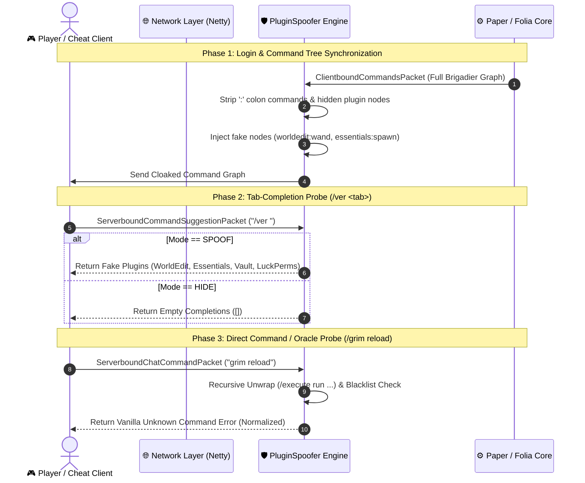

<p align="center">
  
  
  
  
</p>

<h1 align="center">📖 PluginSpoofer — Full Setup, Hardening & Operation Guide</h1>

<p align="center">
  <b>Enterprise Plugin Cloaking & Anti-Reconnaissance Guide for Paper & Folia 1.21+</b><br>
  <em>Conceal backend infrastructure, spoof fake command graphs, and neutralize automated cheat scanners.</em>
</p>

<p align="center">
  <a href="#-quick-start">⚡ Quick Start</a> ·
  <a href="#-overview">🔍 Overview</a> ·
  <a href="#-architecture--packet-flow">🏗️ Architecture</a> ·
  <a href="#-configuration-deep-dive">⚙️ Configuration</a> ·
  <a href="#-anti-reconnaissance-server-hardening">🛡️ Server Hardening</a> ·
  <a href="#-cheat-client-testing--verification">🧪 Testing Guide</a> ·
  <a href="#-troubleshooting--faq">🔧 FAQ</a>
</p>

---

## ⚡ Quick Start

Follow these 4 simple steps to install and deploy PluginSpoofer:

```text
1. Place PluginSpoofer-1.0.jar      →  plugins/
2. Start or Restart Server          →  Default config.yml is generated automatically
3. Configure Mode ("SPOOF" / "HIDE") →  plugins/PluginSpoofer/config.yml
4. Reload Configuration             →  Execute /pluginspoofer reload  ✅
```

---

## 🔍 Overview

When a player connects to your Minecraft server, the server and client exchange several packets revealing your server ecosystem:
1. **`ClientboundCommandsPacket`**: Contains the complete graph of available commands. Real plugins automatically register `plugin:command` namespaces.
2. **`ServerboundCommandSuggestionPacket`**: When a player presses `<Tab>`, completions are returned for `/ver `, `/about `, or `/plugins `.
3. **Command Preprocessing & Error Channels**: Probing invalid or restricted commands exposes plugin brand identity through distinct permission error messages.

**`PluginSpoofer`** acts as a transparent network filter between your server engine and incoming player connections, sanitizing every packet in real-time while providing believable fake metadata.

---

## 🏗️ Architecture & Packet Flow



---

## ⚙️ Configuration Deep Dive

### 1. Operation Modes (`mode`)
* **`SPOOF` (Recommended)**: Returns believable fake plugins for `/plugins`, `/ver <plugin>`, `/ver <tab>`, and injects fake namespace commands into the client's Brigadier tree. Hack clients like Meteor will report that your server is running standard utilities (`WorldEdit`, `Essentials`, `Vault`, `LuckPerms`).
* **`HIDE`**: Returns standard Vanilla unknown command errors for everything. Tab-completion returns no suggestions.

### 2. Fake Plugins Schema (`fake-plugins`)
Each entry in `fake-plugins` defines how the spoofed plugin appears to players and scanners:
```yaml
fake-plugins:
  - name: "WorldEdit"
    version: "7.3.0"
    authors: ["sk89q", "EngineHub"]
    description: "WorldEdit in-game map editor"
    fake-commands:
      - "worldedit:wand"
      - "worldedit:set"
      - "worldedit:cut"
      - "worldedit:paste"
```

### 3. Advanced Command Filter (`command-filter`)
* **`block-response-mode`**:
  * `VANILLA_UNKNOWN`: Emulates the authentic Vanilla 1.21+ command error (`§cUnknown or incomplete command, see below for error§r\n§c<--[HERE]§r`).
  * `CUSTOM`: Sends `custom-block-message`.
* **`blocked-commands`**: Case-insensitive list of commands to block.
* **`blocked-patterns`**: Regex patterns matching prohibited command roots (e.g. `^(bukkit|minecraft|spigot|paper):.*`).
* **`blocked-prefixes`**: Intercepts chat messages starting with cheat client prefixes (`.`, `#`, `@`, `,`, `;`, `!`).
* **`unwrap-execute-commands`**: Recursively unwraps commands wrapped in `/execute as @p run ...` or `/minecraft:execute ...`.

---

## 🛡️ Anti-Reconnaissance Server Hardening

To achieve 100% defense against all possible reconnaissance techniques, apply these additional best practices:

### 1. Disable GameSpy4 UDP Query in `server.properties`
If `enable-query=true`, clients can query the server's UDP port directly to dump the real plugin list without connecting to the server.
```properties
# Set to false to prevent UDP Query plugin leaks
enable-query=false
```

### 2. Protect Resource Pack Ports (ItemsAdder / Oraxen)
If using plugins that host resource packs on separate HTTP ports (e.g. `8888`), ensure the port is reverse-proxied or behind Cloudflare/TCPShield so that attackers cannot uncover your backend Origin IP or unpack plugin asset directories.

### 3. Adjust Tab Completion Limits in `paper-global.yml`
Rate limit command suggestion spam to protect server tick rate:
```yaml
command-suggestion:
  max-completions-per-second: 10
```

---

## 🧪 Cheat Client Testing & Verification

| Client / Tool | Attack Command | Expected Result with PluginSpoofer |
|:---|:---|:---|
| **Meteor Client** | `.server plugins` | Displays only configured fake plugins (`WorldEdit`, `Essentials`, `Vault`, `LuckPerms`). |
| **LiquidBounce** | `Plugins` exploit module | Receives spoofed colon suggestions or empty list. |
| **Wurst 7** | `.plugins` command | Displays spoofed plugin list. |
| **UI-Utils** | Tab suggestion probe | Yields only fake suggestions. |
| **Manual Probe** | `/ver GrimAC`, `/grim reload` | Returns standard Vanilla `Unknown or incomplete command` error. |
| **Wrapper Bypass** | `/execute as @p run ver WorldEdit` | Unwraps cleanly and returns fake `WorldEdit` version info. |
| **Chat Prefix Macro** | `.plugins` in regular chat | Chat is cancelled and player receives unknown command error. |

---

## 🔧 Troubleshooting & FAQ

### Q: Why do OP players see real plugins?
**A:** Players with the permission `pluginspoofer.bypass` (granted to OPs by default) bypass all cloaking. To test cloaking on an operator account, temporarily `/deop` your account or revoke `pluginspoofer.bypass`.

### Q: How do I reload changes made to `config.yml`?
**A:** Run `/pluginspoofer reload` in-game or via console. All caches and configurations will update without requiring a server restart.

### Q: Does PluginSpoofer cause lag or impact TPS?
**A:** No. PluginSpoofer uses compiled regex patterns, immutable sets, and thread-safe models with $O(1)$ lookup complexity, making it fully asynchronous and Folia multi-threaded safe.

---

<p align="center">
  <sub>For questions, bug reports, and updates, join our <b>Discord: <a href="https://discord.gg/KNW2QPjzCV">discord.gg/KNW2QPjzCV</a></b></sub>
</p>
