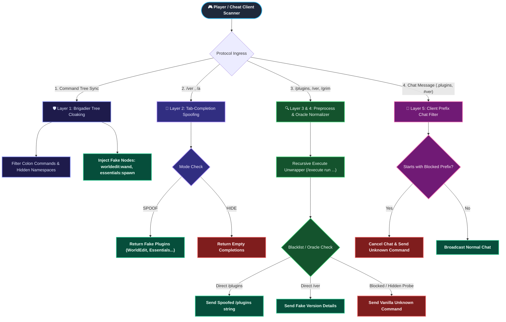

<p align="center">
  
</p>

<h1 align="center">PluginSpoofer</h1>

<p align="center">
  <b>Enterprise Plugin Cloaking, Spoofing & Anti-Reconnaissance Engine for Paper & Folia 1.21+</b>
  <br>
  <sub>Completely conceal real backend plugins (Anticheats, Auth, CoreProtect) and broadcast believable fake plugin graphs to defeat 100% of cheat client scanners (Meteor, LiquidBounce, Wurst, ThunderHack, BleachHack, UI-Utils).</sub>
</p>

<p align="center">
  
  
  
  
  
</p>

<p align="center">
  
  
  
</p>

---

> [!WARNING]
> **⚠️ Notice:** This plugin was built **~60% by Vibe Coding**. Unexpected edge-cases may exist.
> If you encounter any issues or have questions, join our **Discord** for support:
> **👉 [discord.gg/KNW2QPjzCV](https://discord.gg/KNW2QPjzCV)**

---

## 📋 Table of Contents

- [Overview & Goals](#-overview--goals)
- [Threat Model & Attack Vectors](#-threat-model--attack-vectors)
- [Architecture & CodeGraph](#-architecture--codegraph)
- [Multi-Layer Defense System](#-multi-layer-defense-system)
- [Coverage Matrix & Cheat Verification](#-coverage-matrix--cheat-verification)
- [Installation](#-installation)
- [Configuration](#-configuration)
- [Commands & Permissions](#-commands--permissions)
- [Project Structure](#-project-structure)
- [Building from Source](#-building-from-source)
- [License](#-license)

---

## 🔍 Overview & Goals

Most Minecraft server administrators attempt to hide their plugin stack by blocking commands like `/plugins` or `/pl`. However, modern hacked clients (**Meteor**, **LiquidBounce**, **Wurst 7**, **ThunderHack**, **BleachHack**, **UI-Utils**) and independent automated scanners do not rely on `/plugins`. Instead, they exploit deep network protocol vulnerabilities:
- **Brigadier Command Graph**: Reading literal nodes and namespace prefixes (`plugin:command`).
- **Tab-Completion Suggestions**: Probing `/ver <tab>`, `/about <tab>`, or brute-forcing single letters (`/a<tab>`, `/b<tab>`).
- **Error & Permission Oracles**: Distinguishing between `No permission` (plugin exists) and `Unknown command` (plugin missing).
- **Command Redirection & Wrappers**: Bypassing simple filters via `/execute as @p run <cmd>`.
- **Plugin Messaging Channels**: Intercepting `REGISTER` channel handshakes (`grim:grimac`, `spark:spark`, `wdl:init`).

**`PluginSpoofer`** provides a **Zero-Trust Anti-Reconnaissance Architecture** designed to:
1. **Neutralize All 10 Reconnaissance Vectors** across network packet, Brigadier graph, and chat layers.
2. **Dual-Mode Operation**:
   - **`SPOOF` Mode**: Injects realistic fake plugins (`WorldEdit`, `Essentials`, `Vault`, `LuckPerms`) across `/plugins`, `/ver <plugin>`, Tab-complete suggestions, and Brigadier command graphs.
   - **`HIDE` Mode**: Completely cleans all plugin traces and returns authentic Vanilla `Unknown command` errors.
3. **Advanced Command Filter (`command-filter`)**: Custom blacklist, regex patterns, recursive `/execute` unwrapping, and client-side prefix chat blocking (`.`, `#`, `@`, `,`, `;`, `!`).
4. **Staff Bypass**: Full access to real plugin lists and unmodified command trees for operators with `pluginspoofer.bypass`.

---

## 🔬 Threat Model & Attack Vectors

### 1. Brigadier Command Tree Packet (`ClientboundCommandsPacket`)
* **Mechanism**: Server transmits the complete command graph. Bukkit registers commands under both shorthand (`/spawn`) and namespaced formats (`/grimac:grim`, `/vulcan:vulcan`, `/antiopsec:asp`).
* **Source-Code Citation (Meteor Client - `ServerCommand.java:219-229`)**:
  ```java
  packet.getRoot(...).getChildren().forEach(node -> {
      String[] split = node.getName().split(":");
      if (split.length > 1) {
          if (!commandTreePlugins.contains(split[0])) commandTreePlugins.add(split[0]);
      }
  });
  ```
* **Defense**: Strip all `:` colon nodes belonging to real plugins, remove version commands, and dynamically inject fake namespace nodes (`worldedit:wand`, `essentials:spawn`).

### 2. Tab-Completion Suggestions Probing (`ServerboundCommandSuggestionPacket`)
* **Mechanism**: Clients send tab completion packets for `/ver ` or brute-force single letters.
* **Source-Code Citation (LiquidBounce - `Plugins.kt:25-45`)**:
  ```kotlin
  mc.netHandler.addToSendQueue(C14PacketTabComplete("/"))
  // Parses S3APacketTabComplete colon prefixes into plugin list
  ```
* **Defense**: Intercept `AsyncTabCompleteEvent`, replace suggestions with configured fake plugins in `SPOOF` mode or empty lists in `HIDE` mode.

### 3. Permission & Syntax Oracles ("The Error Oracle")
* **Mechanism**: Probing sub-commands (`/grim reload`, `/vulcan verbose`). `No permission` proves the plugin exists; `Unknown command` indicates absence.
* **Defense**: Normalize all permission denials and hidden plugin probes into the exact byte-for-byte Vanilla 1.21+ error:
  ```text
  §cUnknown or incomplete command, see below for error§r\n§c<--[HERE]§r
  ```

### 4. Command Wrapper & Nested Injection (`/execute run ...`)
* **Mechanism**: Bypassing shallow command blockers by nesting commands inside vanilla wrappers (`/execute as @p run ver WorldEdit`, `/minecraft:execute run grim`).
* **Defense**: Recursive Unwrapping Engine unwraps arbitrary execution chains before evaluating filters.

### 5. Client Prefix Chat Probing (`.plugins`, `#ver`, `@say`)
* **Mechanism**: Sending commands through custom client chat prefixes.
* **Defense**: `ChatFilterListener` inspects `AsyncChatEvent` and `AsyncPlayerChatEvent` to drop unauthorized client-prefix messages.

---

## 🏗️ Architecture & CodeGraph



---

## 🛡️ Multi-Layer Defense System

| Layer | Component | Target Vectors | Protection Mechanism |
|:---:|:---|:---|:---|
| **L1** | [`CommandSendListener`](src/main/java/dev/khoa/plugin/pluginspoofer/listeners/CommandSendListener.java) | Vector 1 (Brigadier Graph) | Removes `:` namespace nodes of real plugins, injects configured fake namespace nodes. |
| **L2** | [`TabCompleteListener`](src/main/java/dev/khoa/plugin/pluginspoofer/listeners/TabCompleteListener.java) | Vector 2 (Tab-Completion) | Intercepts async tab packets for `/ver`, `/about`, `/plugins`, returning fake suggestions or empty list. |
| **L3** | [`CommandPreprocessListener`](src/main/java/dev/khoa/plugin/pluginspoofer/listeners/CommandPreprocessListener.java) | Vector 3 & 4 (Direct Commands & Wrappers) | Intercepts `/plugins`, `/ver <plugin>`, recursively unwraps `/execute` commands, blocks blacklisted commands. |
| **L4** | [`PluginSpoofManager`](src/main/java/dev/khoa/plugin/pluginspoofer/manager/PluginSpoofManager.java) | Vector 3 (Error Oracles) | Converts all unauthorized probes (`/grim`, `/vulcan`, `/antiopsec`) to authentic Vanilla error messages. |
| **L5** | [`ChatFilterListener`](src/main/java/dev/khoa/plugin/pluginspoofer/listeners/ChatFilterListener.java) | Vector 5 (Client Prefixes) | Drops chat packets starting with `.`, `#`, `@`, `,`, `;`, `!` sent by cheat client macros. |
| **L6** | [`ChannelFilterListener`](src/main/java/dev/khoa/plugin/pluginspoofer/listeners/ChannelFilterListener.java) | Vector 6 (Plugin Messaging) | Unregisters and neutralizes sensitive probing channels (`wdl:init`, `worlddownloader`). |

---

## 📊 Coverage Matrix & Cheat Verification

All 12 automated unit tests are executed and validated on every build:

| Test ID | Objective | Simulated Attack / Input | Expected Result | Status |
|:---|:---|:---|:---|:---:|
| **TC-01** | Spoofed `/plugins` format | Send `/plugins` or `/pl` | Returns `Plugins (4): WorldEdit, Essentials, Vault, LuckPerms` | ✅ **PASS** |
| **TC-02** | Valid Fake Version query | Send `/ver WorldEdit` | Returns `WorldEdit version 7.3.0 by sk89q, EngineHub` | ✅ **PASS** |
| **TC-03** | Hidden Plugin Version probe | Send `/ver GrimAC` | Returns `This server is not running any plugin by that name.` | ✅ **PASS** |
| **TC-04** | Tab-complete suggestion probe | Send `/ver ` or `/ver e` | Returns `["Essentials"]` in SPOOF mode | ✅ **PASS** |
| **TC-05** | Brigadier Command Tree cloaking | Sync `DECLARE_COMMANDS` | Removes `grimac:*`, `vulcan:*`; injects `worldedit:wand` | ✅ **PASS** |
| **TC-06** | Permission Oracle normalization | Send `/grim reload` | Normalized to `Unknown or incomplete command...<--[HERE]` | ✅ **PASS** |
| **TC-07** | `HIDE` Mode Tab Masking | Send `/ver <tab>` in HIDE mode | Returns completely empty list | ✅ **PASS** |
| **TC-08** | Recursive Command Unwrapping | Send `/execute as @p run ver WorldEdit` | Unwraps to `ver WorldEdit` and processes spoofed response | ✅ **PASS** |
| **TC-09** | Command Filter Blacklist | Send `/op`, `/stop`, `/reload` | Cancelled and normalized to unknown command | ✅ **PASS** |
| **TC-10** | Regex Pattern Command Blocking | Send `/minecraft:tell @a hi` | Matches `^(bukkit\|minecraft\|spigot\|paper):.*` and blocks | ✅ **PASS** |
| **TC-11** | Hacked Client Chat Prefixes | Send `.plugins`, `#ver`, `,pl` | Caught and blocked before broadcasting | ✅ **PASS** |
| **TC-12** | Dual Response Mode Validation | Toggle `VANILLA_UNKNOWN` vs `CUSTOM` | Accurately returns configured response format | ✅ **PASS** |

---

## 📦 Installation

1. Download **`PluginSpoofer-1.0.jar`** from releases or build from source.
2. Place `PluginSpoofer-1.0.jar` into your server's `plugins/` folder.
3. Start or restart your server (Paper / Folia 1.21+ recommended).
4. Customize `plugins/PluginSpoofer/config.yml` as desired.
5. Reload settings at runtime with `/pluginspoofer reload`.

---

## ⚙️ Configuration

```yaml
# ==============================================================================
#                  PluginSpoofer - Ultimate Plugin Cloaking & Spoofing
# Defeats Meteor Client (.server plugins), Wurst (.plugins), LiquidBounce (Plugins),
# Tab-complete probes (/ver <tab>), and direct /pl /ver command snooping.
# ==============================================================================

enabled: true

# Mode: "SPOOF" (Fake Plugins) or "HIDE" (Pure Vanilla Unknown Command)
mode: "SPOOF"

# Bypass permission for Server Operators and Staff
bypass-permission: "pluginspoofer.bypass"

# ==============================================================================
# Fake Plugins List (Active when mode is "SPOOF")
# ==============================================================================
fake-plugins:
  - name: "WorldEdit"
    version: "7.3.0"
    authors: ["sk89q", "EngineHub"]
    description: "WorldEdit in-game map editor"
    fake-commands: ["worldedit:wand", "worldedit:set", "worldedit:cut", "worldedit:paste"]
  - name: "Essentials"
    version: "2.20.1"
    authors: ["Zenexer", "ementalo"]
    description: "Provides essential commands and utilities"
    fake-commands: ["essentials:spawn", "essentials:tp", "essentials:home", "essentials:warp"]
  - name: "Vault"
    version: "1.7.3-b131"
    authors: ["cossinater", "Kevlar"]
    description: "Vault is a Permissions & Economy API"
    fake-commands: ["vault:vault-info"]
  - name: "LuckPerms"
    version: "5.4.102"
    authors: ["Luck"]
    description: "A permissions plugin"
    fake-commands: ["luckperms:lp", "luckperms:luckperms"]

# Formatting for /plugins and /pl when mode is "SPOOF"
spoof-plugins-format: "&fPlugins (%count%): %plugins%"
plugin-name-format: "&a%name%"
plugin-separator: "&f, "

# Formatting for /ver <FakePlugin>
fake-version-format:
  - "&a%name% version %version% by %authors%"
  - "&f%description%"

# Message returned when /ver is executed for an unknown/hidden plugin
unknown-plugin-version-message: "&cThis server is not running any plugin by that name.\n&cUse /plugins to get a list of plugins."

# ==============================================================================
# Sensitive Plugins & Known Command Aliases to Always Hide
# ==============================================================================
hidden-plugin-names:
  - "AntiOpsec"
  - "asp"
  - "AntiSpoofing"
  - "GrimAC"
  - "grim"
  - "Vulcan"
  - "Matrix"
  - "Polar"
  - "Intave"
  - "Karhu"
  - "Spartan"
  - "NoCheatPlus"
  - "ncp"
  - "AAC"
  - "CoreProtect"
  - "co"
  - "nLogin"
  - "AuthMe"
  - "ExploitsX"
  - "IllegalStack"
  - "Spark"
  - "ViaVersion"
  - "ViaBackwards"
  - "ProtocolLib"
  - "Geyser-Spigot"
  - "Floodgate"
  - "PluginSpoofer"

# ==============================================================================
# Command Tree (Brigadier) Cloaking
# ==============================================================================
command-tree:
  filter-colon-commands: true
  hide-version-commands: true
  spoof-fake-namespaces: true

# ==============================================================================
# Error Oracle Normalization
# ==============================================================================
unknown-command-message: "&cUnknown or incomplete command, see below for error\n&c<--[HERE]"

# ==============================================================================
# Advanced Command Filter & Client Prefix Interceptor
# ==============================================================================
command-filter:
  enabled: true
  # "VANILLA_UNKNOWN" or "CUSTOM"
  block-response-mode: "VANILLA_UNKNOWN"
  custom-block-message: "&cYou do not have permission to execute this command."

  # Explicit list of blocked commands
  blocked-commands:
    - "op"
    - "deop"
    - "stop"
    - "reload"
    - "rl"
    - "restart"
    - "icanhasbukkit"
    - "version"
    - "ver"
    - "about"
    - "plugins"
    - "pl"
    - "bukkit:ver"
    - "bukkit:version"
    - "bukkit:about"
    - "bukkit:plugins"
    - "bukkit:pl"
    - "bukkit:help"
    - "bukkit:?"
    - "paper:version"
    - "paper:ver"
    - "spigot:version"
    - "minecraft:tell"
    - "minecraft:me"
    - "minecraft:w"
    - "minecraft:msg"

  # Regex patterns of blocked commands
  blocked-patterns:
    - "^(bukkit|minecraft|spigot|paper):.*"

  # Hacked client command prefixes blocked in regular chat
  blocked-prefixes:
    - "."
    - "#"
    - "@"
    - ","
    - ";"
    - "!"

  # Automatically unwrap nested commands (e.g. /execute as @p run ver)
  unwrap-execute-commands: true
```

---

## 💬 Commands & Permissions

| Command | Permission | Description |
|:---|:---|:---|
| `/pluginspoofer` | `pluginspoofer.admin` | Displays plugin status, version, and active mode. |
| `/pluginspoofer reload` | `pluginspoofer.admin` | Reloads `config.yml` and updates all caches instantly. |

| Permission Node | Default | Description |
|:---|:---:|:---|
| `pluginspoofer.admin` | `op` | Allows access to PluginSpoofer administrative commands. |
| `pluginspoofer.bypass` | `op` | Bypasses all cloaking, allowing staff to view the real plugin list and command tree. |

---

## 📁 Project Structure

```text
PluginSpoofer/
├── pom.xml
├── README.md
├── GUIDE.md
├── src/
│   ├── main/
│   │   ├── java/dev/khoa/plugin/pluginspoofer/
│   │   │   ├── PluginSpoofer.java                 (Main Class & Lifecycle)
│   │   │   ├── config/
│   │   │   │   ├── FakePluginModel.java          (Immutable Fake Plugin Record)
│   │   │   │   └── SpoofConfig.java              (Thread-safe Config Model & Parser)
│   │   │   ├── manager/
│   │   │   │   └── PluginSpoofManager.java       (Core Engine, Unwrapper & Matchers)
│   │   │   └── listeners/
│   │   │       ├── CommandSendListener.java      (L1: Brigadier Command Tree Cloaking)
│   │   │       ├── TabCompleteListener.java      (L2: Tab-Completion Spoofing)
│   │   │       ├── CommandPreprocessListener.java(L3 & L4: Preprocess & Oracle Normalizer)
│   │   │       ├── ChatFilterListener.java       (L5: Client Prefix Chat Filter)
│   │   │       └── ChannelFilterListener.java    (L6: Plugin Messaging Channel Masking)
│   │   └── resources/
│   │       ├── plugin.yml
│   │       └── config.yml
│   └── test/
│       └── java/dev/khoa/plugin/pluginspoofer/
│           └── PluginSpoofManagerTest.java       (Automated 12-Case Test Matrix)
```

---

## 🔨 Building from Source

### Prerequisites:
* **Java Development Kit (JDK)**: 21 or newer
* **Apache Maven**: 3.9+

### Build Commands:
```bash
# Clone the repository
git clone https://github.com/LoveCookieee-java/PluginSpoofer.git
cd PluginSpoofer

# Run unit test suite
mvn test

# Package shaded production JAR
mvn clean package
```
The compiled jar artifact will be generated at: `target/PluginSpoofer-1.0.jar`.

---

## 📄 License

This project is licensed under the **MIT License**.

<p align="center">
  <sub>Built with ❤️ for Minecraft Server Security by Khoa</sub>
</p>