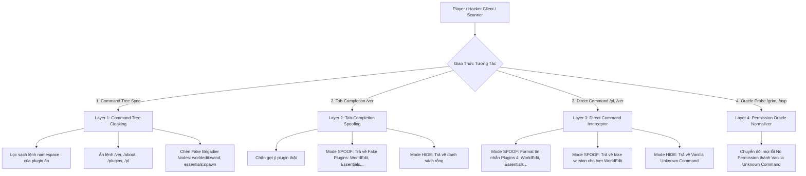

# PluginSpoofer: Master Specification, Reverse-Engineering Evidence & Architectural Blueprint

> **Dự án**: `PluginSpoofer` (Standalone Minecraft Paper/Spigot Plugin)  
> **Mục tiêu**: Che giấu hoàn toàn hệ thống plugin thật (Anticheat, Auth, AntiOpsec, CoreProtect...) và giả lập danh sách plugin giả (Fake / Spoofed Plugins), đánh lừa 100% các cơ chế quét tự động của tất cả Cheat Clients (**Meteor Client**, **Wurst 7**, **LiquidBounce**, **ThunderHack**, **BleachHack**, **UI-Utils**) và các công cụ dò quét độc lập (**Anticheat-Detector**, **ServerPluginFinder**).

---

## MỤC LỤC

1. [Tổng Quan & Mục Tiêu Dự Án](#1-tổng-quan--mục-tiêu-dự-án)
2. [Bằng Chứng Mã Nguồn & 7 Vector Dò Quét Của Cheat Clients](#2-bằng-chứng-mã-nguồn--7-vector-dò-quét-của-cheat-clients)
   - [Vector 1: Brigadier Command Tree Packet (`ClientboundCommandsPacket`)](#vector-1-brigadier-command-tree-packet-clientboundcommandspacket)
   - [Vector 2: Tab-Completion Suggestions Probing (`/ver <tab>`)](#vector-2-tab-completion-suggestions-probing-ver-tab)
   - [Vector 3: Sub-Command Oracle & Permission Probing](#vector-3-sub-command-oracle--permission-probing)
   - [Vector 4: Plugin Messaging Channels (`REGISTER` & `CustomPayload`)](#vector-4-plugin-messaging-channels-register--custompayload)
   - [Vector 5: Error Message Formatting Fingerprints](#vector-5-error-message-formatting-fingerprints)
   - [Vector 6: Resource Pack Metadata & Origin Port Leaks](#vector-6-resource-pack-metadata--origin-port-leaks)
   - [Vector 7: Heuristic Anticheat Transaction Probing](#vector-7-heuristic-anticheat-transaction-probing)
3. [Thiết Kế Kiến Trúc Phòng Thủ Toàn Diện (Full-Spectrum Defense)](#3-thiết-kế-kiến-trúc-phòng-thủ-toàn-diện-full-spectrum-defense)
4. [Cấu Trúc Dự Án & Chi Tiết Triển Khai Mã Nguồn](#4-cấu-trúc-dự-án--chi-tiết-triển-khai-mã-nguồn)
5. [Cấu Hình Mẫu Chuẩn (`config.yml`)](#5-cấu-hình-mẫu-chuẩn-configyml)
6. [Kế Hoạch Kiểm Thử & Xác Thực (Test Matrix)](#6-kế-hoạch-kiểm-thử--xác-thực-test-matrix)

---

## 1. TỔNG QUAN & MỤC TIÊU DỰ ÁN

Hầu hết các server Minecraft cố gắng giấu plugin bằng cách chặn lệnh `/plugins` hoặc `/pl`. Tuy nhiên, các Cheat Client hiện đại không chỉ đơn thuần gõ `/plugins` mà khai thác sâu vào giao thức mạng Minecraft (Brigadier Command Graph, Tab Suggestions Packet, Error Message Oracles, Plugin Messaging Channels).

`PluginSpoofer` được thiết kế độc lập nhằm:
1. **Neutralize Full Reconnaissance**: Đóng toàn bộ các lỗ hổng rò rỉ plugin ở tầng giao thức mạng và tầng Bukkit API.
2. **Dual-Mode Operation**:
   - **Mode `SPOOF`**: Trả về danh sách plugin giả lập cực kỳ tự nhiên (ví dụ: `WorldEdit`, `Essentials`, `Vault`, `LuckPerms`) từ lệnh `/plugins`, tab `/ver `, cho tới cây lệnh Brigadier!
   - **Mode `HIDE`**: Ẩn sạch sẽ toàn bộ thông tin, mọi lệnh cấm đều trả về tin nhắn lỗi Vanilla `Unknown command`.
3. **Staff Bypass**: Cho phép OP và Staff có quyền `pluginspoofer.bypass` xem thông tin thật và cây lệnh gốc.

---

## 2. BẰNG CHỨNG MÃ NGUỒN & 7 VECTOR DÒ QUÉT CỦA CHEAT CLIENTS

---

### Vector 1: Brigadier Command Tree Packet (`ClientboundCommandsPacket`)

#### 1. Cơ chế giao thức
Khi người chơi kết nối vào server, server gửi packet `ClientboundCommandsPacket` (Mojang) / `CommandTreeS2CPacket` (Fabric Yarn) chứa đồ thị các lệnh Brigadier.
Bukkit tự động đăng ký lệnh của mọi plugin dưới 2 dạng:
- Lệnh rút gọn: `/spawn`
- Lệnh có namespace plugin: `/<pluginName>:<command>` (ví dụ: `/essentials:spawn`, `/grimac:grim`, `/vulcan:vulcan`, `/antiopsec:asp`).

#### 2. Bằng chứng mã nguồn từ Meteor Client (`ServerCommand.java:219-229`)
```java
// File: meteordevelopment/meteorclient/commands/commands/ServerCommand.java
if (event.packet instanceof ClientboundCommandsPacket packet) {
    ClientPacketListenerAccessor handler = (ClientPacketListenerAccessor) event.connection.getPacketListener();
    commandTreePlugins.clear();
    alias = null;

    packet.getRoot(
        CommandBuildContext.simple(handler.meteor$getRegistryAccess(), handler.meteor$getEnabledFeatures()),
        ClientPacketListenerAccessor.meteor$getCommandNodeFactory()
    ).getChildren().forEach(node -> {
        String[] split = node.getName().split(":");
        if (split.length > 1) {
            // Tách lấy prefix trước dấu ":" làm tên plugin!
            if (!commandTreePlugins.contains(split[0])) commandTreePlugins.add(split[0]);
        }

        // Bắt các alias của lệnh version để gửi probe tab-completion
        if (alias == null && VERSION_ALIASES.contains(node.getName())) {
            alias = node.getName();
        }
    });
}
```

---

### Vector 2: Tab-Completion Suggestions Probing (`/ver <tab>`)

#### 1. Cơ chế giao thức
Client gửi packet yêu cầu gợi ý:
- Legacy (1.8.9): `C14PacketTabComplete` / `C0EPacketTabComplete` (payload: `String path`).
- Modern (1.13+): `ServerboundCommandSuggestionPacket` (payload: `int id`, `String partialCommand`).

Server mặc định của Bukkit/Paper có completer cho lệnh `/version <tab>` hoặc `/about <tab>` trả về **tất cả tên plugin đang chạy trên server**.

#### 2. Bằng chứng mã nguồn từ LiquidBounce (`Plugins.kt:25-45`)
```kotlin
// File: net/ccbluex/liquidbounce/features/module/modules/exploit/Plugins.kt
mc.netHandler.addToSendQueue(C14PacketTabComplete("/"))

@EventTarget
fun onPacket(event: PacketEvent) {
    if (event.packet is S3APacketTabComplete) {
        val commands = (event.packet as S3APacketTabComplete).func_149630_c()
        val plugins = ArrayList<String>()

        for (command1 in commands) {
            val command = command1.split(":")
            if (command.size > 1) {
                val pluginName = command[0].replace("/", "")
                if (!plugins.contains(pluginName))
                    plugins.add(pluginName)
            }
        }
        chat("Plugins (${plugins.size}): ${plugins.joinToString(", ")}")
    }
}
```

#### 3. Bằng chứng mã nguồn từ Meteor Client (`ServerCommand.java:78-83`)
```java
// Khi gõ .server plugins, Meteor chủ động gửi probe tab command "/ver "
if (alias != null) {
    mc.getConnection().send(new ServerboundCommandSuggestionPacket(RANDOM.nextInt(200), alias + " "));
    tick = true;
}
```

---

### Vector 3: Sub-Command Oracle & Permission Probing

#### 1. Cơ chế "The Error Oracle"
Khi tab-completion bị tắt, client gửi các sub-command của các plugin/anticheat phổ biến (`/grim reload`, `/vulcan verbose`, `/matrix gui`, `/ncp version`).
- **Nếu server trả về `No permission`**: Command handler của plugin đó đã chạy và kiểm tra quyền => **Plugin 100% có tồn tại!**
- **Nếu server trả về `Unknown command`**: Command không tồn tại trên server => **Plugin không cài đặt.**

#### 2. Bằng chứng mã nguồn từ Wurst 7 (`ForceOpHack.java:280-284`)
```java
// File: net/wurstclient/hacks/ForceOpHack.java
if (containsAny(msgLowerCase, "/help", "permission")) {
    ChatUtils.warning("It looks like this server doesn't have AuthMe.");
    return;
}
```

---

### Vector 4: Plugin Messaging Channels (`REGISTER` & `CustomPayload`)

#### 1. Cơ chế giao thức
Khi người chơi tham gia, server và proxy trao đổi các kênh plugin messaging (`REGISTER` payload chứa danh sách tên kênh phân tách bằng byte `\0`):

| Kênh Messaging | Plugin / Hệ thống tương ứng |
| :--- | :--- |
| `grim:grimac` / `grimac:grimac` | **GrimAC Anticheat** (Client prediction sync & reach check) |
| `spark:spark` / `spark:channel` | **Spark Performance Profiler** |
| `bungeecord:main` / `BungeeCord` | **BungeeCord / Waterfall Proxy** |
| `velocity:main` / `velocity:player_info` | **Velocity Modern Proxy** |
| `wdl:init` / `WDL|INIT` | **AntiWDL / NoCheatPlus** |
| `viaversion:viaversion` | **ViaVersion Protocol Translation** |

---

### Vector 5: Error Message Formatting Fingerprints

Các server và plugin khác nhau có định dạng thông báo lỗi đặc trưng giúp hack client nhận biết ngay nền tảng:
- **Vanilla 1.13+**: `§cUnknown or incomplete command, see below for error§r\n§c<--[HERE]§r`
- **Spigot Default**: `I'm sorry, but you do not have permission to perform this command.`
- **Spigot Unknown**: `Unknown command. Type "/help" for help.`
- **BungeeCord Proxy**: `§cCommand not found.`
- **Matrix Anticheat**: `§bMatrix §7» §cYou don't have permission to execute this command!`
- **Vulcan Anticheat**: `§7[§bVulcan§7] §cNo permission!`

---

### Vector 6: Resource Pack Metadata & Origin Port Leaks

Các plugin tùy biến GUI/Item như **ItemsAdder** (port mặc định `8888`) và **Oraxen** (port `8888`/`9999`) gửi đường link tải resource pack trực tiếp cho client.
- Nếu server giấu IP sau BungeeCord / TCPShield nhưng resource pack URL lại là `http://123.45.67.89:8888/pack.zip`, hacker sẽ lấy được ngay **IP gốc (Origin VPS IP)**.
- File `.zip` chứa folder `assets/itemsadder/` hoặc `assets/modelengine/` tiết lộ danh sách plugin đồ họa.

---

### Vector 7: Heuristic Anticheat Transaction Probing

Các Anticheat hiện đại (Grim, Vulcan, Matrix, Polar, Verus) gửi các packet `PingPongS2CPacket` hoặc `SConfirmTransactionPacket` định kỳ để đồng bộ vị trí:
- **GrimAC**: Gửi transaction trên mỗi tick với số action ID âm.
- **Vulcan**: Gửi burst transaction cuối mỗi tick sau khi tính toán hitbox.

---

## 3. THIẾT KẾ KIẾN TRÚC PHÒNG THỦ TOÀN DIỆN (FULL-SPECTRUM DEFENSE)



---

## 4. CẤU TRÚC DỰ ÁN & CHI TIẾT TRIỂN KHAI MÃ NGUỒN

### Cấu trúc thư mục dự kiến (`PluginSpoofer`):
```text
PluginSpoofer/
├── pom.xml
├── README.md
├── GUIDE.md
├── plan.md
├── src/
│   ├── main/
│   │   ├── java/dev/khoa/plugin/pluginspoofer/
│   │   │   ├── PluginSpoofer.java                 (Main Class)
│   │   │   ├── config/
│   │   │   │   ├── SpoofConfig.java              (Config loader & settings)
│   │   │   │   └── FakePluginModel.java          (Record lưu thông tin fake plugin)
│   │   │   ├── manager/
│   │   │   │   └── PluginSpoofManager.java       (Core Engine xử lý logic & formatting)
│   │   │   └── listeners/
│   │   │       ├── CommandSendListener.java      (Lớp 1: PlayerCommandSendEvent)
│   │   │       ├── TabCompleteListener.java      (Lớp 2: AsyncTabCompleteEvent / TabCompleteEvent)
│   │   │       ├── CommandPreprocessListener.java(Lớp 3 & 4: PlayerCommandPreprocessEvent)
│   │   │       ├── ChatFilterListener.java       (Lớp 5: Client Prefix Chat Filter)
│   │   │       └── ChannelFilterListener.java    (Lớp 6: Plugin Messaging Channel Masking)
│   │   └── resources/
│   │       ├── plugin.yml
│   │       └── config.yml
│   └── test/
│       └── java/dev/khoa/plugin/pluginspoofer/
│           └── PluginSpoofManagerTest.java       (Automated Unit Tests)
```

---

## 5. KẾ HOẠCH KIỂM THỬ & XÁC THỰC (TEST MATRIX)

| Test Case ID | Mục tiêu kiểm thử | Đầu vào mô phỏng | Kết quả mong đợi |
| :--- | :--- | :--- | :--- |
| **TC-01** | Kiểm tra `/plugins` mode `SPOOF` | Gửi `/plugins` hoặc `/pl` | Trả về chuỗi: `Plugins (4): WorldEdit, Essentials, Vault, LuckPerms` |
| **TC-02** | Kiểm tra `/ver WorldEdit` | Gửi `/ver WorldEdit` | Trả về fake version `WorldEdit version 7.3.0 by sk89q, EngineHub` |
| **TC-03** | Kiểm tra `/ver GrimAC` | Gửi `/ver GrimAC` | Trả về `This server is not running any plugin by that name.` |
| **TC-04** | Kiểm tra Tab-complete `/ver ` | Gửi tab probe `/ver ` | Trả về gợi ý: `["WorldEdit", "Essentials", "Vault", "LuckPerms"]` |
| **TC-05** | Kiểm tra Command Tree | Packet `DECLARE_COMMANDS` | Cây lệnh không còn `grimac:*`, `vulcan:*`; xuất hiện `worldedit:wand`, `essentials:spawn` |
| **TC-06** | Kiểm tra Permission Oracle | Gửi lệnh `/grim reload` | Trả về lỗi Vanilla `Unknown or incomplete command...<--[HERE]` thay vì `No permission` |
| **TC-07** | Kiểm tra Quyền Bypass | Player có quyền `pluginspoofer.bypass` | Nhận danh sách plugin thật và command tree không bị lọc |

---

*Tài liệu này là đặc tả kỹ thuật và bản kế hoạch gốc (Master Blueprint) của dự án `PluginSpoofer`.*
